<p align="center">
  <a href="https://github.com/QubitManagement/Qubit-Menu">
    
  </a>
</p>

<p align="center">
  
</p>

<p align="center">
  <b>Community-powered. Open-source. Limitless.</b>
</p>

<p align="center">
  
</p>

<p align="center">
  <a href="https://github.com/QubitGT/Qubit/releases">
    
  </a>
  <a href="https://github.com/QubitGT/Qubit/releases/latest">
    
  </a>
  <a href="https://discord.gg/qubit">
    
  </a>
</p>

<p align="center">
  <a href="https://github.com/QubitManagement/Qubit-Menu/stargazers">
    
  </a>
  <a href="https://github.com/QubitManagement/Qubit-Menu/issues">
    
  </a>
  <a href="https://github.com/QubitManagement/Qubit-Menu/network/members">
    
  </a>
  
</p>

<br>

<p align="center">
  <a href="#-about-qubit">About</a>
  •
  <a href="#-features">Features</a>
  •
  <a href="#-installation">Installation</a>
  •
  <a href="#-compatibility">Compatibility</a>
  •
  <a href="#-community">Community</a>
  •
  <a href="#-license">License</a>
</p>


## ⚡ About Qubit

**Qubit Menu** is a community-driven mod menu for Gorilla Tag.

It is designed to provide a clean, flexible, and accessible platform for experimenting with features, customizing your experience, and contributing to the Gorilla Tag modding community.

Whether you are a player, developer, tester, or contributor, Qubit is built to give you the tools to explore and create.

> **Simple enough to use. Powerful enough to customize. Open enough to improve.**


## ✨ Features

<table>
<tr>
<td width="50%">

### 🧩 Modular

Qubit is designed around a modular feature system, making it easier to add, remove, and maintain features.

</td>
<td width="50%">

### 🎛️ Customizable

Customize your experience and use the features that work best for you.

</td>
</tr>

<tr>
<td width="50%">

### 🚀 Performance Focused

Built with stability, usability, and performance in mind.

</td>
<td width="50%">

### 🌐 Community Driven

Community feedback, suggestions, and contributions help shape Qubit's future.

</td>
</tr>

<tr>
<td width="50%">

### 🛠️ Developer Friendly

Open-source code makes it easier to learn, inspect, modify, and contribute.

</td>
<td width="50%">

### 🔮 Constantly Improving

Qubit continues to evolve through updates, fixes, and community contributions.

</td>
</tr>
</table>


## 🧠 Why open source?

The modding community should be built around:

- Sharing knowledge
- Learning from one another
- Experimenting with new ideas
- Improving existing projects
- Keeping development accessible
- Giving credit to original creators

Qubit is open-source so that everyone can inspect the code, learn from it, suggest improvements, and contribute to the project.

No unnecessary paywalls.  
No hidden source code.  
No malicious software.  
No artificial barriers.

Just community-driven development.

<details>
<summary><b>Read more about the Qubit open-source philosophy</b></summary>

Open-source projects allow users and developers to inspect the code, report problems, suggest improvements, and create new features.

By making Qubit available to the community, the project can grow through collaboration instead of being controlled by a single person or organization.

</details>


## 📥 Installation

### Download the latest release

1. Open the [latest Qubit release](https://github.com/QubitManagement/Qubit-Menu/releases/latest).
2. Download the newest release file.
3. Extract the downloaded archive.
4. Move `Qubit-Menu.dll` into your Gorilla Tag plugins folder.
5. Launch Gorilla Tag.

Your folder structure should look similar to this:

```text
Gorilla Tag/
└── BepInEx/
    └── plugins/
        └── Qubit-Menu.dll
```

> Your folder structure may differ depending on your mod loader and installation method.


## 🧱 Building from source

### Requirements

- Visual Studio 2022 or newer
- .NET development tools
- A legal installation of Gorilla Tag
- BepInEx or the required modding framework
- Git

### Clone the repository

```bash
git clone https://github.com/QubitManagement/Qubit-Menu.git
cd Qubit-Menu
```

### Build instructions

1. Open the solution in Visual Studio.
2. Open `Directory.Build.props`.
3. Update the `<GamePath>` value if Gorilla Tag is installed somewhere else.
4. Restore the project dependencies.
5. Build the project using:

```text
Ctrl + Shift + B
```

If configured correctly, the compiled DLL will be copied to your plugins folder automatically.


## 🎛️ Compatibility

### Operating systems

| Operating System | Menu | Fonts | Images | Sounds | Videos |
|:-----------------|:----:|:-----:|:------:|:------:|:------:|
| Windows 10 | ✅ | ✅ | ✅ | ✅ | ✅ |
| Windows 11 | ✅ | ✅ | ✅ | ✅ | ✅ |
| macOS | ✅ | ✅ | ✅ | ✅ | ❌ |
| Linux | ✅ | ✅ | ✅ | ✅ | ❌ |

### Headsets

| Headset | Menu | Mods |
|:--------|:----:|:----:|
| Rift | ✅ | ✅ |
| Rift S | ✅ | ✅ |
| Oculus Go | ⚠️ | ❌ |
| Quest 1 | ✅ | ✅ |
| Quest 2 | ✅ | ✅ |
| Quest Pro | ✅ | ✅ |
| Quest 3 / 3S | ✅ | ✅ |
| Pico 4 / Pro | ✅ | ✅ |
| Pico 4 Ultra Pro | ✅ | ⚠️ |
| Valve Index | ✅ | ✅ |
| HTC VIVE / Pro | ✅ | ⚠️ |
| HP Reverb G1 / G2 | ✅ | ⚠️ |

### Legend

| Symbol | Meaning |
|:------:|:--------|
| ✅ | Fully functional |
| ⚠️ | Limited or partially functional |
| ❌ | Not supported |
| ❓ | Untested |

> Compatibility information may change as Qubit and Gorilla Tag are updated.


## 🗺️ Roadmap

- [x] Create the Qubit project
- [x] Establish the purple Qubit visual identity
- [x] Create an expandable feature system
- [x] Publish the project for community development
- [ ] Improve configuration tools
- [ ] Expand developer documentation
- [ ] Add more customization options
- [ ] Improve performance and stability
- [ ] Add more community-requested features
- [ ] Create a dedicated Qubit website
- [ ] Improve testing and release automation

Have an idea for Qubit? Share it in the [Qubit Discord server](https://discord.gg/2PVfydMxyc).


## ◈ The Qubit identity

<table>
<tr>
<td width="38%" align="center">


</td>
<td width="62%">

Qubit is built around a simple idea:

> **Give the community the tools to explore, create, and improve.**

The Qubit logo represents a connected system of ideas, features, and developers working together.

The visual identity focuses on:

- Dark backgrounds
- Bright purple highlights
- Minimal interfaces
- Strong contrast
- Futuristic design
- Modular systems
- Community-driven development

</td>
</tr>
</table>

### Color palette

| Purpose | Color |
|:-------|:------|
| Background black | `#000000` |
| Primary purple | `#9747FF` |
| Bright purple | `#A855F7` |
| Violet accent | `#7C3AED` |
| Deep purple | `#24104F` |
| Text white | `#FFFFFF` |


## 🧩 Can I use the code?

Yes, but you must follow the **[GPL-3.0 License](https://www.gnu.org/licenses/gpl-3.0.html)**.

If you use code from Qubit:

- Your project must remain open-source
- You must give appropriate credit
- You must include the GPL-3.0 license
- You must disclose significant modifications
- You must follow all license requirements
- You may not use the project for malicious purposes

Please read the complete license before using or redistributing Qubit code.


## 🛠️ Contributing

Contributions are welcome.

### Before submitting a pull request

- Make sure the project builds successfully
- Test your changes
- Keep your code readable
- Avoid unrelated changes
- Explain what your pull request does
- Include screenshots or videos when useful
- Update documentation when necessary

### Contribution workflow

```bash
git checkout -b feature/my-new-feature
git add .
git commit -m "Add my new feature"
git push origin feature/my-new-feature
```

Then open a pull request on GitHub.

### Helpful contribution ideas

- Bug fixes
- Performance improvements
- UI improvements
- Documentation
- Configuration improvements
- Better error handling
- Testing improvements
- New community-requested features


## 🐛 Reporting bugs

When reporting a bug, please include:

```text
Qubit version:
Gorilla Tag version:
Operating system:
Headset:
Mod loader:
What happened:
What was expected:
Steps to reproduce:
Logs or screenshots:
```

Please do not include private or sensitive information in bug reports.


## 💬 Community

Join the Qubit community for:

- Support
- Bug reports
- Feature suggestions
- Development updates
- Project discussions
- Collaboration

<p align="center">
  <a href="https://discord.gg/2PVfydMxyc">
    
  </a>
</p>

<p align="center">
  <a href="https://discord.gg/2PVfydMxyc">https://discord.gg/2PVfydMxyc</a>
</p>


## ❓ Frequently asked questions

<details>
<summary><b>Is Qubit affiliated with Gorilla Tag?</b></summary>

No. Qubit is an independent community project and is not affiliated with, endorsed by, or sponsored by Gorilla Tag or Another Axiom LLC.

</details>

<details>
<summary><b>Is Qubit free?</b></summary>

Qubit is intended to remain free and accessible to the community.

</details>

<details>
<summary><b>Can I contribute?</b></summary>

Yes. Contributions, suggestions, testing, documentation, and bug reports are welcome.

</details>

<details>
<summary><b>Where can I get support?</b></summary>

Join the [Qubit Discord server](https://discord.gg/2PVfydMxyc).

</details>

<details>
<summary><b>Why is my installation not working?</b></summary>

Make sure that:

- You downloaded the correct version
- The DLL is in the correct plugins folder
- Your mod loader is installed correctly
- Required dependencies are present
- Gorilla Tag has been restarted
- Your game version is compatible

If the issue continues, create a bug report with your logs.

</details>


## ⚠️ Disclaimer

Qubit Menu is an independent community project.

It is not affiliated with Gorilla Tag, Another Axiom LLC, or any of their associated products. Gorilla Tag and related trademarks belong to their respective owners.

Use modifications responsibly and follow the rules of the communities and games you participate in.


## 📄 License

Qubit Menu is licensed under the **GNU General Public License v3.0**.

```text
Copyright (C) 2026 Qubit

This program is free software: you can redistribute it and/or modify
it under the terms of the GNU General Public License as published by
the Free Software Foundation, either version 3 of the License, or
(at your option) any later version.

This program is distributed in the hope that it will be useful,
but WITHOUT ANY WARRANTY; without even the implied warranty of
MERCHANTABILITY or FITNESS FOR A PARTICULAR PURPOSE. See the
GNU General Public License for more details.

You should have received a copy of the GNU General Public License
along with this program. If not, see <https://www.gnu.org/licenses/>.
```

The names **Qubit**, **Qubit Menu**, the Qubit logo, artwork, and branding are not covered by the GPL-3.0 License.



<p align="center">
  <b>QUBIT</b><br>
  <sub>Built by the community. Powered by imagination.</sub>
</p>
